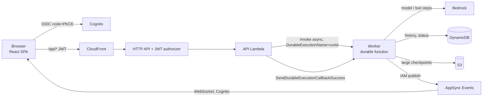

# strands-lambda-durable example: durable chat app

A deployable example for [strands-lambda-durable](https://github.com/har1101/strands-lambda-durable), which runs [Strands Agents](https://strandsagents.com) (TypeScript) on [AWS Lambda durable functions](https://docs.aws.amazon.com/lambda/latest/dg/durable-functions.html).

This repository contains:

| Path | What |
| --- | --- |
| [`examples/chat`](examples/chat) | An authenticated chat web app (React + Vite on CloudFront/S3, Cognito). It streams live over AppSync Events, keeps conversation history in DynamoDB, and shows approve/reject buttons for refunds. The backend uses the library from its [v0.1.1 release](https://github.com/har1101/strands-lambda-durable/releases/tag/v0.1.1). |
| [`docs/research`](docs/research) | The research notes that motivated the design (Japanese). |

The library lives in its own repository: [har1101/strands-lambda-durable](https://github.com/har1101/strands-lambda-durable) (English and Japanese README, API reference, tests). It makes each model call and each tool use a durable step, runs parallel tools with a deterministic journal, and turns Strands interrupts into durable callbacks (human-in-the-loop). It also records MCP tool lists, offloads large checkpoints to S3, and restores `appState` and `modelState` on replay.

## Why

The [AWS AI workflows sample](https://github.com/aws-samples/sample-ai-workflows-in-aws-lambda-durable-functions) runs a whole Strands invocation in one durable step, so a crash repeats all model and tool work. Strands' own checkpoints are separate from the Lambda journal. This package joins Strands' public `Model.stream`, `Tool.stream`, and tool-executor extension points to the durable journal. It does not change the Strands agent loop. Python users have a comparable integration for Pydantic AI ([`pydantic-ai-harness`](https://docs.aws.amazon.com/durable-execution/sdk-reference/integrations/pydantic-ai/)); this package fills that role for Strands TypeScript.

## Positioning

- **A Strands extension, published as its own package.** The library follows the [Strands extension guidelines](https://strandsagents.com/docs/contribute/contributing/extensions/): npm name `strands-{name}`, and the SDKs are peer dependencies. It can be listed in the [Strands community catalog](https://strandsagents.com/docs/integrations/get-featured/). The catalog lists building blocks, so this example app is kept in a separate repository.
- **Not a fork of Strands.** It needs no Strands changes. Two small upstream extension points would simplify it. Both have been proposed: exporting `InterruptError` ([strands-agents/harness-sdk#4541](https://github.com/strands-agents/harness-sdk/pull/4541)), and a documented, stable `ToolExecutor` base ([#762](https://github.com/strands-agents/harness-sdk/issues/762)).
- **A candidate for the AWS Durable Execution integrations page**, next to Pydantic AI ([docs repo](https://github.com/aws/aws-durable-execution-docs)).

## Develop

```bash
npm ci
npm run typecheck
npm run build
```

CI (`.github/workflows/ci.yml`) typechecks and builds the example backend and frontend, and lints the SAM template. The library's tests run in [its own repository](https://github.com/har1101/strands-lambda-durable).

## Deploy the example chat app

Requirements: Node.js 22+, AWS CLI, AWS SAM CLI, and credentials that can deploy CloudFormation, IAM, Lambda, DynamoDB, S3, CloudFront, Cognito, AppSync, and API Gateway. You also need Bedrock access to the model; the default is `us.anthropic.claude-haiku-4-5-20251001-v1:0` in `us-east-1`.

```bash
# STACK_NAME defaults to strands-durable-chat. AWS_REGION defaults to us-east-1, but an AWS_REGION already set in your shell wins.
AWS_PROFILE=<profile> AWS_REGION=us-east-1 examples/chat/scripts/deploy.sh
# Sign-up is disabled; create a user (Cognito emails a temporary password):
aws cognito-idp admin-create-user --user-pool-id <UserPoolId output> \
  --username you@example.com --user-attributes Name=email,Value=you@example.com Name=email_verified,Value=true
```

Open the `SiteUrl` output and sign in. Some prompts to try:

- 「A-1001 と B-2002 の注文状況をまとめて調べて」 runs two `lookup_order` tool uses in parallel. Each runs in its own child context.
- 「注文 A-1001 に 3000 円を返金して」 raises an interrupt. The Lambda invocation ends, and the UI shows 承認 and 却下 buttons. Your answer resumes the same tool use in a new invocation.

`npm run smoke -w @strands-lambda-durable/example-chat-backend` checks the deployed backend without the UI; the `smoke:approval` and `smoke:parallel` scripts cover the other scenarios. They need `WORKER_ALIAS_ARN`, `CONVERSATIONS_TABLE`, and `MESSAGES_TABLE` from the stack outputs.

Delete everything with `sam delete --stack-name strands-durable-chat`. Empty the site and offload buckets first.



### Verified deployment

On 2026-09-23, the stack was deployed to `us-east-1` with Claude Haiku 4.5:

- **Smoke scripts.** `replay` finished `SUCCEEDED` in 2 invocations, with `model-1` recorded once. `approval` suspended with 1 completed invocation, resumed after the callback, and ran the tool in `tools-1-0` and then `tools-2-0`. `parallel` put two `lookup_order` tool uses in `tools-1-0` and `tools-1-1`.
- **Web app in headless Chromium.** Tested through Cognito managed login:
  - Parallel lookups streamed live over AppSync Events.
  - A second turn in the same conversation used the saved history.
  - The pending approval and the prompt survived a page reload.
  - 承認 issued the refund, and 却下 resumed the same tool use with `rejected`.

## Design coverage

The design and acceptance tests are in [docs/research/durable-functions-ts-research.md](docs/research/durable-functions-ts-research.md) §5 and §7. "local" means covered by the library's `npm test`; "AWS" means also checked against the deployed example.

| Acceptance test | Status |
| --- | --- |
| A model step is saved, then the process stops → the model is not called again | Done (local, AWS) |
| A/B/C, stop after B → work continues from C | Done (local) |
| Stop after a side effect, before its checkpoint → no duplicate business result | Stable `idempotencyKey`. The external API must deduplicate on it |
| Human approval suspends → a new invocation continues after the callback | Done (local, AWS) |
| A transient model or tool error → only that step is retried | Done (local: throttling retried, validation not retried, `RetryableToolError`) |
| An error result or interrupt → restored without an extra infrastructure retry | Done (local, AWS) |
| An MCP server's tool list changes → a running execution keeps the recorded list | Done (local) |
| Another execution in a warm environment → no state is shared | By design: all adapter state is per invocation |
| A tool updates `appState` → the same state after replay | Done (local) |
| Parallel tools finish in a different order → the `toolUseId` mapping is unchanged | Done (local, AWS) |
| A stream stops midway → completed calls are not billed again; the unfinished attempt is replaced | Done for completed calls; the `attempt` ID replaces the partial text |
| A new version is published while old executions run → they keep their code | By design: executions are pinned to the version behind the `live` alias |

## License

MIT
