# minamo入門: Lambda durable functionsでAIエージェントのループを止まらないものにする

この記事は、AIエージェントのループをAWS Lambda durable functionsの上で「途中で止まっても続きから再開できる」ようにする小さなTypeScriptライブラリ、[minamo](https://github.com/har1101/minamo)を解説します。

読者として、AWSのサービスには詳しいものの、ソフトウェア開発の経験はそれほど多くない人を想定しています。そのため、TypeScriptのコードがどうやってLambdaの上で動くのか、durable functionsが裏側で何をしているのか、といった前提から順に説明します。

この記事で扱う内容は次のとおりです。

1. 解きたい問題
2. Lambda durable functionsの仕組み
3. minamoとは何か
4. minamoの設計の原則
5. TypeScriptのコードがLambdaで動くまで
6. durable functionsの上でminamoが動く流れ
7. SDKとの連携: `@minamojs/lambda-df`を読む
8. 使い方: チャットアプリの例
9. パフォーマンスチューニング
10. 制約と今後
11. 参考資料

記事中の数値は、2026-09-24にus-east-1で動かした結果と、`@minamojs/minamo`のバージョン`0.1.0-alpha.0`と、`@aws/durable-execution-sdk-js`のバージョン2.4.0のコードを読んだ結果です。minamoはalpha版なので、APIは今後変わる可能性があります。

## 解きたい問題

### AIエージェントのループ

AIエージェントは、次のループを繰り返すプログラムです。

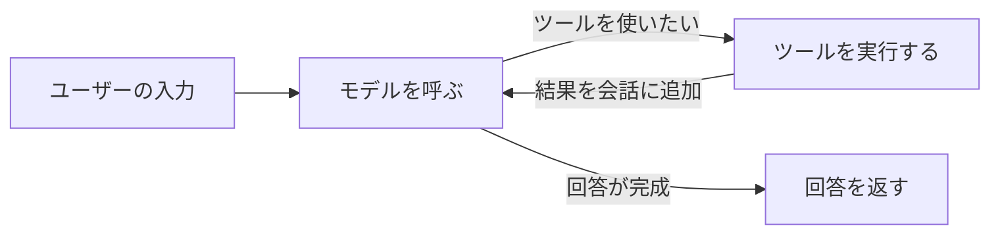

モデル(Amazon BedrockのClaudeなど)は、回答の代わりに「このツールをこの引数で呼んでほしい」という指示を返すことがあります。プログラムはツールを実行し、その結果を会話に加えてもう一度モデルを呼びます。モデルが最終的な回答を返したら、ループを抜けます。

### 普通のLambdaで書いたときに困ること

このループを普通のLambda関数で書くと、次の問題が起きます。

| 問題 | 具体例 |
| --- | --- |
| 1回の呼び出しは最大15分 | ツールの呼び出しが多い調査タスクは、15分を超えることがあります |
| 途中で失敗すると最初からやり直しになる | 3回目のモデル呼び出しでスロットリングエラーが起きると、1回目と2回目のモデル呼び出しをもう一度実行し、その分のトークン代をもう一度払います |
| 人の承認を待てない | 返金の承認を1時間待つあいだ、関数は動き続けて課金されます。15分を超えると待てません |
| 副作用が二重に起きる | 返金APIを呼んだ直後に失敗すると、やり直しで返金をもう一度実行する恐れがあります |

必要なのは「完了した処理の結果を保存しておき、やり直すときは保存した結果を使う」仕組みです。Lambda durable functionsがこの仕組みを提供し、minamoはその仕組みをエージェントのループに当てはめます。

## Lambda durable functionsの仕組み

[Lambda durable functions](https://docs.aws.amazon.com/lambda/latest/dg/durable-functions.html)は、Lambdaの機能の1つです。AWSのドキュメントは、durable functionsを「最長1年実行できる、回復力のある複数ステップのアプリケーションとAIワークフローを作るための機能」と説明しています。

### チェックポイントとリプレイ

durable functionsの中心は、チェックポイント(checkpoint)とリプレイ(replay)です。

- チェックポイント: 関数のコードは、処理を「オペレーション」という単位で実行します。SDKは、オペレーションが終わるたびにその結果をLambdaのサービス側に保存します。
- リプレイ: 関数がもう一度呼ばれると、コードは先頭から実行し直します。ただし、SDKは保存済みのオペレーションを実行せず、保存した結果をそのまま返します。

[Key concepts](https://docs.aws.amazon.com/durable-execution/getting-started/key-concepts/)のページは、オペレーションごとの処理を「保存済みの結果があるか確認する、なければ実行する、結果をシリアライズする、チェックポイントAPIで保存してから先へ進む、結果を返す」という順序で説明しています。

次の図は、途中で待機(wait)を挟む実行を示します。1回目の呼び出しと2回目の呼び出しは、別々のLambdaの実行(invocation)です。

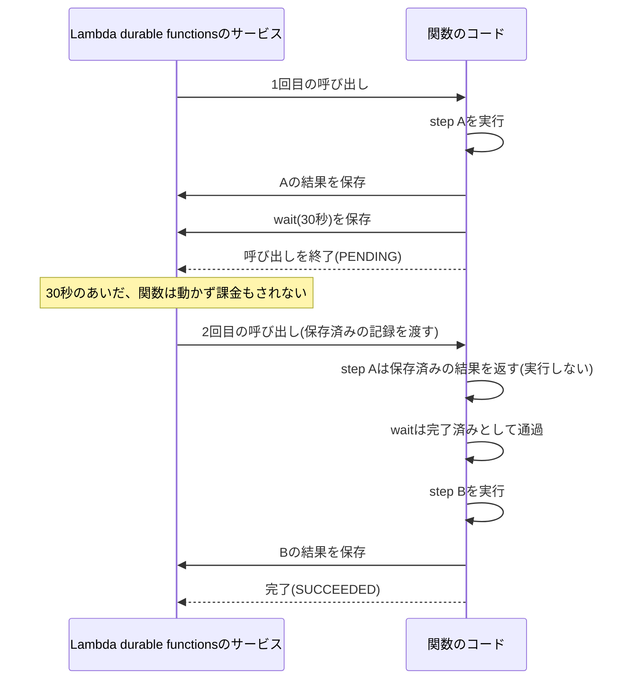

ここで大事なのは、「実行中のメモリやスタックを保存するわけではない」という点です。durable functionsは、コードを毎回先頭から実行し直し、完了済みのオペレーションの戻り値を記録から取り出すことで、前回と同じ状態を再現します。

### オペレーションの種類

[durable execution SDKのページ](https://docs.aws.amazon.com/lambda/latest/dg/durable-execution-sdk.html)は、次のオペレーションを挙げています。minamoが使うのは、表のうち上の3つです。

| オペレーション | TypeScriptのSDK | 役割 | minamoでの使い道 |
| --- | --- | --- | --- |
| Step | `context.step` | 任意の処理を実行し、結果を保存します | モデル呼び出し、普通のツール |
| Child context | `context.runInChildContext` | 独立した名前空間の中で、複数のオペレーションをまとめて実行します | ツール呼び出しごとの囲い |
| Callback | `context.waitForCallback` | 外部から結果が届くまで停止します | 人の承認 |
| Wait | `context.wait` | 指定した時間だけ停止します | (minamoは使いません。チャットの例ではテスト用に直接使います) |
| Invoke | `context.invoke` | 別のLambda関数を呼び、結果を待ちます | 使いません |
| Map、Parallel | `context.map`、`context.parallel` | 複数の処理を並列に実行します | 使いません |

停止中の関数は動いていないので、[Lambdaの料金](https://aws.amazon.com/lambda/pricing/)のうち実行時間(duration)の料金はかかりません。

### 決定性のルール

リプレイで同じ状態を再現するには、コードが毎回同じ順序で同じオペレーションを呼ぶ必要があります。[Determinismのベストプラクティス](https://docs.aws.amazon.com/durable-execution/patterns/best-practices/determinism/)は、「durableなオペレーションの外にあるコードは、ハンドラーの入力と完了済みのオペレーションの結果だけで決まる純粋な関数でなければならない」と述べています。

つまり、オペレーションの外では、呼ぶたびに結果が変わりうる処理(`Date.now()`、`Math.random()`、`crypto.randomUUID()`、HTTPリクエスト、AWS SDKの呼び出しなど)を使ってはいけません。1回目とリプレイで値が変わるからです。こうした処理はstepの中に入れます。stepの中なら、リプレイでは記録した値が返ります。例外は、結果が変わらないことを自分で保証できる読み取りだけです(チャットの例の履歴の読み込みがこれに当たります。「ハンドラー」の節で説明します)。

```ts
// 良くない: リプレイのたびに別のIDが作られる。完了済みのstepは古いIDで記録されているので、後続の処理とずれる
const orderId = crypto.randomUUID();
await context.step("create-order", async () => createOrder(orderId));

// 良い: IDの生成もstepにする。リプレイでは1回目に作ったIDが返る
const orderId = await context.step("new-order-id", async () => crypto.randomUUID());
await context.step("create-order", async () => createOrder(orderId));
```

[Key concepts](https://docs.aws.amazon.com/durable-execution/getting-started/key-concepts/)は、次のルールも挙げています。

1. 1つのコンテキストの中のdurableなオペレーションは、順番に開始しなければならない。
2. オペレーションを並行に実行したいときは、それぞれを子コンテキストで囲む。
3. 子コンテキストの`DurableContext`は、その子コンテキストの中だけで使う。

minamoの設計の多くは、この3つのルールを利用者が意識しなくても守れるようにするためのものです。

### バージョンとエイリアス

[Invoking durable functions](https://docs.aws.amazon.com/lambda/latest/dg/durable-invoking.html)によると、durable functionsはバージョン番号かエイリアス、または`$LATEST`を付けたARNで呼び出す必要があります。実行は、開始したときのバージョンに固定されます。リプレイは記録を書いたときと同じコードで動く必要があるからです。`$LATEST`で開始した実行は、更新後のコードで再開してしまい、決定性が崩れる恐れがあります。本番ではバージョンかエイリアスを使います。

チャットの例では、SAMの`AutoPublishAlias: live`でデプロイのたびに新しいバージョンを発行し、`live`エイリアスを呼び出します。

### 上限と料金

エージェントのループで意識する上限は次のとおりです。

| 項目 | 値 | 出典 |
| --- | --- | --- |
| 1回の呼び出しの最大時間 | 15分(900秒) | [Lambdaのクォータ](https://docs.aws.amazon.com/lambda/latest/dg/gettingstarted-limits.html) |
| 1つの実行の最大時間 | 1年(`ExecutionTimeout`は1〜31,622,400秒) | [Configure durable functions](https://docs.aws.amazon.com/lambda/latest/dg/durable-configuration.html) |
| 1つの実行のオペレーション数 | 3,000(引き上げ不可、自動リトライも数える) | [Lambdaのクォータ](https://docs.aws.amazon.com/lambda/latest/dg/gettingstarted-limits.html) |
| 1つの実行で書き込めるデータ量 | 100MB(引き上げ不可) | [Lambdaのサービスクォータ](https://docs.aws.amazon.com/general/latest/gr/lambda-service.html) |
| step、child context、wait、callbackの1回のチェックポイント | 256KB | [OperationUpdate API](https://docs.aws.amazon.com/lambda/latest/api/API_OperationUpdate.html) |
| 記録の保持期間 | 1〜90日、既定は14日 | [Configure durable functions](https://docs.aws.amazon.com/lambda/latest/dg/durable-configuration.html) |

料金は、通常のLambdaの料金(リクエストと実行時間。リプレイのための呼び出しも含む)に、次の3つが加わります([Lambdaの料金](https://aws.amazon.com/lambda/pricing/))。

- durableなオペレーションの数。us-east-1の料金例では100万オペレーションあたり8.00ドルです。
- 書き込んだデータ量。料金例では1GBあたり0.25ドルです。
- 保持しているデータ量。料金例では1GB・月あたり0.15ドルです。

オペレーションの数え方は[SDKのページ](https://docs.aws.amazon.com/lambda/latest/dg/durable-execution-sdk.html)にあります。stepは「1 + リトライ回数」、child contextは1、`waitForCallback`は「3 + リトライ回数」(子コンテキスト、コールバック、stepの3つ)です。

## minamoとは何か

### 一言でいうと

minamoは、エージェントのループのうち「モデル呼び出しとツール呼び出しをdurableにする部分」だけを持つ、依存ゼロの小さなライブラリです。名前は水面(みなも)から取っています。READMEは「下で何が動いていても、上は静か」というイメージを掲げています。

minamoは次の2つのnpmパッケージに分かれています。

| パッケージ | 中身 | 依存 |
| --- | --- | --- |
| [`@minamojs/minamo`](https://www.npmjs.com/package/@minamojs/minamo) | コア。`Durable`インターフェース、`model()`、`runTools()`、`Retry`、コーデック、テスト用の`MemoryEngine` | なし |
| [`@minamojs/lambda-df`](https://www.npmjs.com/package/@minamojs/lambda-df) | Lambda durable functions用のアダプター。`lambda(context)`だけを公開します | `@minamojs/minamo`と`@aws/durable-execution-sdk-js`をpeer dependencyとして参照します |

esbuildで最小化(minify)すると、コアは1,775バイト(gzip後927バイト)、Lambdaのアダプターは932バイト(gzip後521バイト)です。この記事のために手元で計測しました。

### 全体の構造

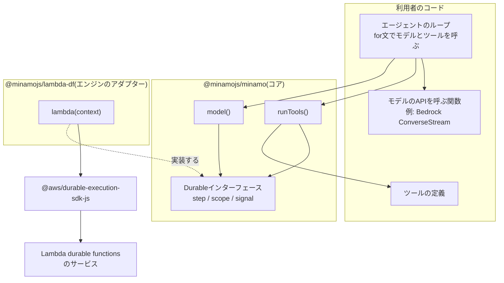

利用者は、ループ、ツール、モデルのAPIを呼ぶ関数を自分で書きます。minamoは、そのうちモデル呼び出しとツール呼び出しを、`Durable`インターフェースの3つのメソッドを通じて記録します。`Durable`を実際のエンジン(Lambda durable functions)につなぐのは、アダプターの`lambda(context)`です。

### 提供するもの

`Durable`インターフェースは、次の3つのメソッドと1つのプロパティだけです。

```ts
export interface Durable {
  /** リプレイや再開をまたいで変わらない実行のID */
  readonly executionId: string;
  /** fnを実行して結果を記録する。retryがなければ1回だけ実行する */
  step<T>(name: string, fn: (info: StepInfo) => Promise<T>, options?: { retry?: Retry }): Promise<T>;
  /** 子のスコープを作り、その中でdurableなオペレーションを使えるようにする */
  scope<T>(name: string, fn: (child: Durable) => Promise<T>): Promise<T>;
  /** publishに渡したトークンを誰かが完了させるまで停止する */
  signal<T>(name: string, publish: (token: string) => Promise<void>, options?: { timeout?: Duration }): Promise<T>;
}
```

(コメントは説明のために日本語にしています。原文は[packages/core/src/index.ts](https://github.com/har1101/minamo/blob/main/packages/core/src/index.ts)にあります。)

コアは、この3つのメソッドの上に2つの関数を用意しています。

| 関数 | 役割 |
| --- | --- |
| `model(durable, name, call, options?)` | モデル呼び出し1回を1つのstepとして実行します。モデルのストリームが返したイベントをすべて配列として記録し、その配列を返します。リプレイでは、モデルを呼ばずに記録した配列を返します |
| `runTools(durable, turn, calls, tools)` | 1ターン分のツール呼び出しを並列に実行します。ツール呼び出しごとに`<turn>:<ツール呼び出しID>`という名前のスコープを、呼び出し順に開きます |

ツールは2種類あります。

- 普通のツール(`run`を持つ): 1つのstepとして実行します。例外を投げると、その内容をエラーの結果としてモデルに返します。`RetryableError`を投げたときだけ、stepをリトライします。
- workflowツール(`workflow`を持つ): 自分用の`Durable`を受け取り、stepやsignalを使えます。人の承認や、サブエージェントの呼び出しに使います。

### Honoとの対応

minamoはWebフレームワークの[Hono](https://hono.dev/)の考え方を参考にしています。Honoのドキュメントは、Honoを「Web標準の上に作った、小さく、シンプルで、非常に速いWebフレームワーク」と紹介し、「依存ゼロでWeb標準だけを使う」「同じコードがすべてのプラットフォームで動く」と説明しています([Honoの概要](https://hono.dev/docs/)、[Web Standard](https://hono.dev/docs/concepts/web-standard))。

| Hono | minamo |
| --- | --- |
| Web標準の`Request`と`Response`を共通の型にする | `Durable`インターフェース(step、scope、signal)と、JSONと`Uint8Array`のコーデックを共通の型にする |
| ランタイムごとのアダプター(`hono/aws-lambda`など)で差を吸収する | エンジンごとのアダプター(`@minamojs/lambda-df`など)で差を吸収する |
| 依存ゼロで、`hono/tiny`プリセットは14KB未満 | 依存ゼロで、コアはminify後2KB未満 |
| `app.request()`でサーバーを立てずにテストできる([Testing](https://hono.dev/docs/guides/testing)) | `MemoryEngine`でAWSを使わずにテストでき、任意の地点でクラッシュさせられる |

Honoが「どのランタイムでも同じアプリのコードが動く」ことを目指すように、minamoは「どのdurable実行エンジンでも同じエージェントのコードが動く」ことを目指しています。現在の対象は、最優先がLambda durable functions、次の候補がCloudflare Workflowsです。

## minamoの設計の原則

この章では、minamoが何を決めたか、そしてなぜそう決めたかを説明します。どれも、小さなフレームワークを作るときに一般的に役立つ考え方です。設計の一次資料は[docs/design.ja.md](https://github.com/har1101/minamo/blob/main/docs/design.ja.md)です。

### 依存を持たず、Web標準のAPIだけを使う

minamoのコアは、npmのパッケージにも、Node.js専用のAPI(`node:`で始まるモジュール、`Buffer`、`AsyncLocalStorage`)にも依存しません。バイト列のbase64変換には、ブラウザでもNode.jsでもBunでも使える`btoa`と`atob`を使います。

理由は2つあります。

- 依存が少ないほど、利用者のバンドルは小さくなり、コールドスタートが短くなります。また、依存するパッケージの脆弱性やバージョンの衝突に巻き込まれません。
- Web標準のAPIだけで書けば、Node.js以外のランタイム(Cloudflare Workers、Bun、Deno)でも同じコードが動きます。minamoはBunでもリプレイが動くことを確認しています。

エンジンのSDK(`@aws/durable-execution-sdk-js`)は、アダプターのpeer dependencyにしています。peer dependencyは「このパッケージを使う側が、指定のパッケージを自分でインストールしておく」という宣言です。Lambda durable functionsの利用者はもともとSDKをインストールしているので、minamoを入れても依存は増えません。

### エンジンの差はアダプターに閉じ込める

コアは`Durable`インターフェースだけを知っていて、Lambdaについては何も知りません。Lambdaとの接続は`@minamojs/lambda-df`の`lambda(context)`が担当し、テストでは`MemoryEngine`が同じインターフェースを実装します。

この形は、ソフトウェア設計で「依存関係逆転」と呼ばれる考え方です。上位の部品(エージェントのループ)が下位の部品(特定のクラウドのSDK)に直接依存せず、両者が間のインターフェースに依存します。こうしておくと、エンジンを差し替えてもループのコードは変わりません。

### オペレーションの同一性を「名前」と「開始順」の両方で決める

エンジンによって、記録済みの結果とオペレーションを対応付ける方法が違います。

| エンジン | 対応付けの方法 |
| --- | --- |
| Lambda durable functions | 呼び出し順。SDKはコンテキストごとのカウンターでIDを作ります(「オペレーションIDの決まり方」の節) |
| Cloudflare Workflows | stepの名前。[Rules of Workflows](https://developers.cloudflare.com/workflows/build/rules-of-workflows/)は「stepの名前はキャッシュのキーとして働く」と説明しています |
| minamoの`MemoryEngine` | 名前 |

minamoは両方の方式で正しく動くように、次の2つを同時に守ります。

- 名前: スコープの中で一意で、決定的な名前を付けます。モデル呼び出しは`model-1`、`model-2`、ツールのスコープは`tools-1:<ツール呼び出しID>`です。ツール呼び出しIDはモデルの応答に含まれ、その応答はstepで記録されるので、リプレイでも同じ値になります。
- 開始順: `runTools()`は、どのツールも待たずに、すべてのスコープを呼び出し順に同期的に開きます。

2つ目の点を図にすると次のようになります。2つのツールのどちらが先に終わっても、スコープを開いた順序(=LambdaのオペレーションID)は変わりません。

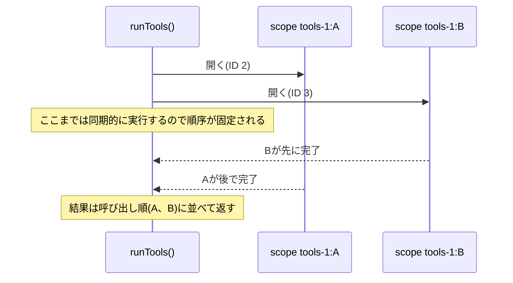

### コーデックはエンジンの境界に置く

durable functionsは、stepの戻り値をJSON文字列にして保存します。ところがJSONは`Uint8Array`(バイト列。画像や音声のデータ)をそのまま表せず、`{"0":1,"1":2,...}`のようなオブジェクトに変えてしまいます。

minamoは、`Uint8Array`を`{"$bytes":"<base64>"}`という形に変換する`stringify`と、その逆の`parse`を持っています。そして、エンジンが保存するすべての値(step、scope、signal)にこのコーデックを通します。

開発の途中では、モデルとツールの関数の中だけでこの変換をしていました。すると、スコープの戻り値として保存されるときに変換が抜け、`Uint8Array`が壊れました。この経験から、「値の変換は、値が外に出ていく境界で1回だけ行う」という原則にしています。

### コンテキストは引数で渡す

Node.jsには`AsyncLocalStorage`という、関数の引数を使わずに「今どの処理の中にいるか」を伝える仕組みがあります。便利ですが、Node.js専用のAPIです。

minamoは`AsyncLocalStorage`を使わず、必要な情報を引数で渡します。ツールは、`idempotencyKey`、`attempt`(何回目の試行か)、workflowツールなら`durable`を引数で受け取ります。コードを読むだけで何がどこから来るのか分かり、Web標準のAPIだけで書けます。

なお、LambdaのSDKは内部で`AsyncLocalStorage`を使っています。minamoのコアはSDKの内部に依存しないので、この点は影響しません。

### 業務のエラーとインフラのリトライを分ける

ツールで起きるエラーには、性質の違う2種類があります。

| 種類 | 例 | どうするべきか |
| --- | --- | --- |
| 業務のエラー | 注文IDが存在しない、入力の形式が違う | リトライしても結果は同じです。エラーの内容をモデルに見せ、モデルに対応させます |
| 一時的なインフラのエラー | 外部APIのタイムアウト、スロットリング | 少し待ってリトライすれば成功する見込みがあります |

minamoは、普通のツールが投げた例外をstepの中で捕まえ、「エラーの結果」というデータとして記録します。記録したデータなので、リプレイで再実行されることはありません。リトライするのは、`Retry.when`が真を返すエラー(ツールの既定では`RetryableError`)だけです。

`Retry`は、`maxAttempts`、`initialDelay`、`maxDelay`、`backoffRate`、`when`という宣言的な形をしています。宣言的な形にしておくと、どのエンジンのリトライ設定にも変換できます。

### 既定値をエンジンに任せない

LambdaのSDKの`context.step`は、`retryStrategy`を省略するとSDKの既定のリトライ(合計6回、5秒から60秒の指数バックオフ)を使います([Retries](https://docs.aws.amazon.com/durable-execution/sdk-reference/error-handling/retries/))。一方、`MemoryEngine`は省略するとリトライしません。これではエンジンによって振る舞いが変わります。

minamoは、`step`に`retry`がなければ、どのエンジンでも1回だけ実行します。Lambdaのアダプターは、そのために`() => ({ shouldRetry: false })`を明示的に渡します。リトライの既定値は、エンジンではなくminamoのコアが決めます。

| 対象 | 既定のリトライ |
| --- | --- |
| `step`(`retry`なし) | リトライしない |
| `model()` | 一時的なエラー(スロットリング、service unavailable、internal server、タイムアウト、接続の切断)だけを、最大4回、2秒から30秒の間隔で試行します |
| 普通のツール | `RetryableError`だけを、最大3回、1秒から30秒の間隔で試行します |

一時的なエラーかどうかは、`throttl`や`service.?unavailable`のような語で判定します。`429`や`5\d\d`のような数字では判定しません。「520 tokens」のような検証エラーの文言に一致して、リトライしてしまうからです。

### exactly-onceを約束しない

「ツールをちょうど1回だけ実行する」ことは、durable functionsでも保証できません。ツールが返金APIを呼んだ直後、結果を記録する前にプロセスが止まると、リプレイでツールがもう一度実行されます。[SDKのStepのページ](https://docs.aws.amazon.com/durable-execution/sdk-reference/operations/step/)も、既定の`AtLeastOncePerRetry`は「SDKが結果を保存する前にリプレイすると、stepを再実行する」と説明しています。

minamoは、少なくとも1回(at-least-once)であることを正直に示し、その代わりに各ツールへ`idempotencyKey`(`<executionId>#<ツール呼び出しID>`)を渡します。この値はリトライでもリプレイでも変わりません。外部のAPIがこの値で重複を排除すれば、実質的に1回だけの効果になります。

### 小さくするために持たないもの

minamoは、次のものを意図的に持ちません。

- エージェントのフレームワーク(Strands Agents、Vercel AI SDKなど)へのアダプター。ループは利用者が15行ほどで書けます。
- メッセージの形式。モデルのストリームが返したイベントを、そのまま記録します。
- ツールの入力のスキーマ検証。ツールごとに自分で検証します。
- 時間だけ待つ`sleep`、大きな値をS3に退避するオフロード。必要になったら追加する予定です。

持たないものを決めておくと、APIが小さく保たれ、利用者が覚えることも減ります。

## TypeScriptのコードがLambdaで動くまで

この章は、minamoに限らず、TypeScriptのLambda関数全般に当てはまる内容です。

### TypeScriptは型を消してJavaScriptになる

Lambdaのランタイム(Node.js)が実行できるのはJavaScriptです。TypeScriptは、JavaScriptに「型」という注釈を足した言語です。

TypeScriptの[ハンドブック](https://www.typescriptlang.org/docs/handbook/2/basic-types.html)は、「TypeScript固有のコードのほとんどは消去され、型注釈がプログラムの実行時の振る舞いを変えることはない」と説明しています。つまり、次の2つのコードは実行時にまったく同じ動きをします。

```ts
// TypeScript
function add(a: number, b: number): number {
  return a + b;
}
```

```js
// 型を消したJavaScript
function add(a, b) {
  return a + b;
}
```

このことから、次の2つのことが分かります。

- 型は、開発中にミスを見つけるための道具です。実行時には存在しないので、実行時の入力(モデルが返したツールの引数など)が型どおりである保証にはなりません。minamoがツールの入力を「各ツールが自分で検証する」としているのは、このためです。
- 型を消す作業は機械的で速いので、ビルドの時間はほとんどかかりません。

なお、Node.js自身も[型を取り除いて`.ts`ファイルを直接実行する機能](https://nodejs.org/api/typescript.html)を持っています(v24.12.0で安定版)。ただし、この機能は`node_modules`の中の`.ts`は扱わず、依存をまとめる(バンドルする)こともしません。Lambdaでは、次に説明するバンドラーでJavaScriptにまとめるのが一般的です。

### 型チェックとバンドルは別の道具が担当する

チャットの例では、2つの道具を使い分けています。

| 道具 | 役割 | 出力 |
| --- | --- | --- |
| `tsc --noEmit`(TypeScriptのコンパイラー) | 型が正しいかを検査するだけです | なし |
| [esbuild](https://esbuild.github.io/) | 型を取り除き、importしているすべてのパッケージを1つのファイルにまとめます | `dist/worker/index.mjs` |

AWSの[TypeScriptのドキュメント](https://docs.aws.amazon.com/lambda/latest/dg/lambda-typescript.html)も、「esbuildは型チェックをしないので、`tsc --noEmit`を実行する」ことを勧めています。

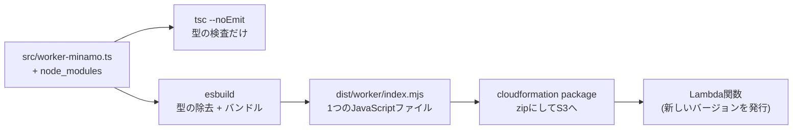

バンドルとは、importの連鎖をたどって、使っているコードを1つのファイルにまとめる作業です([esbuildのAPI](https://esbuild.github.io/api/))。esbuildは「tree shaking」も行います。これは、どこからも使われていない関数や変数を出力から取り除く処理です。パッケージの`package.json`に`"sideEffects": false`と書いてあると、esbuildは「使われていないファイルは丸ごと消してよい」と判断できます。minamoの2つのパッケージは、この宣言をしています。

チャットの例のビルドスクリプト([scripts/build.mjs](../../examples/chat/backend/scripts/build.mjs))の主な設定は次のとおりです。

```js
const common = {
  bundle: true,        // importしているパッケージをすべて1ファイルにまとめる
  platform: "node",    // Node.jsの組み込みモジュール(node:fsなど)はまとめずに残す
  target: "node22",    // Node.js 22が理解できる構文で出力する
  format: "esm",       // import/exportを使うESモジュール形式で出力する
  // CommonJS形式の依存がrequire()を使えるようにする
  banner: { js: "import { createRequire as __bannerCreateRequire } from 'node:module'; const require = __bannerCreateRequire(import.meta.url);" },
};
```

出力ファイルの拡張子は`.mjs`です。Node.jsは`.mjs`をESモジュールとして読み込みます。AWSの[Node.jsのハンドラーのドキュメント](https://docs.aws.amazon.com/lambda/latest/dg/nodejs-handler.html)は、トップレベルの`await`が使えるESモジュールを勧めています。

`banner`の行は少し分かりにくいので補足します。npmのパッケージには、古い形式(CommonJS)で書かれ、`require()`で他のモジュールを読み込むものがあります。ESモジュールの中には`require`が存在しないので、`createRequire`で`require`を作っておきます。

### デプロイ

チャットの例は、SAMのテンプレート(`template.yaml`)を使いますが、SAM CLIは使いません。AWS CLIだけで次の2つのコマンドを実行します。

1. `aws cloudformation package`: テンプレートの`CodeUri: dist/worker`が指すディレクトリをzipにしてS3にアップロードし、テンプレートの中のパスをS3のURLに書き換えます。
2. `aws cloudformation deploy`: CloudFormationがテンプレートの`Transform: AWS::Serverless-2016-10-31`を処理し、SAMの記法を通常のCloudFormationのリソースに展開します。`AutoPublishAlias`と`DurableConfig`も、この展開の中で処理されます。

ワーカー関数の設定は次の部分です。

```yaml
Worker:
  Type: AWS::Serverless::Function
  Properties:
    CodeUri: dist/worker
    Handler: index.handler        # index.mjsのhandlerというexportを呼ぶ
    Runtime: nodejs22.x
    Architectures: [arm64]
    MemorySize: 1024
    Timeout: 300                  # 1回の呼び出しの上限
    AutoPublishAlias: live        # デプロイのたびにバージョンを発行し、liveを向ける
    DurableConfig:
      ExecutionTimeout: 3600      # 1つの実行(承認待ちを含む)の上限
      RetentionPeriodInDays: 7
```

`Timeout`と`ExecutionTimeout`の違いが重要です。`Timeout`は1回の呼び出しの上限で、`ExecutionTimeout`は停止と再開をすべて含めた実行全体の上限です。[Configure durable functions](https://docs.aws.amazon.com/lambda/latest/dg/durable-configuration.html)によると、durable executionは関数を作るときにしか有効にできず、既存の関数にはあとから付けられません。

### Lambdaの実行環境の中で起きること

Lambdaは、関数を「実行環境」という隔離された小さな環境の中で動かします([Lambdaの実行環境のライフサイクル](https://docs.aws.amazon.com/lambda/latest/dg/lambda-runtime-environment.html))。

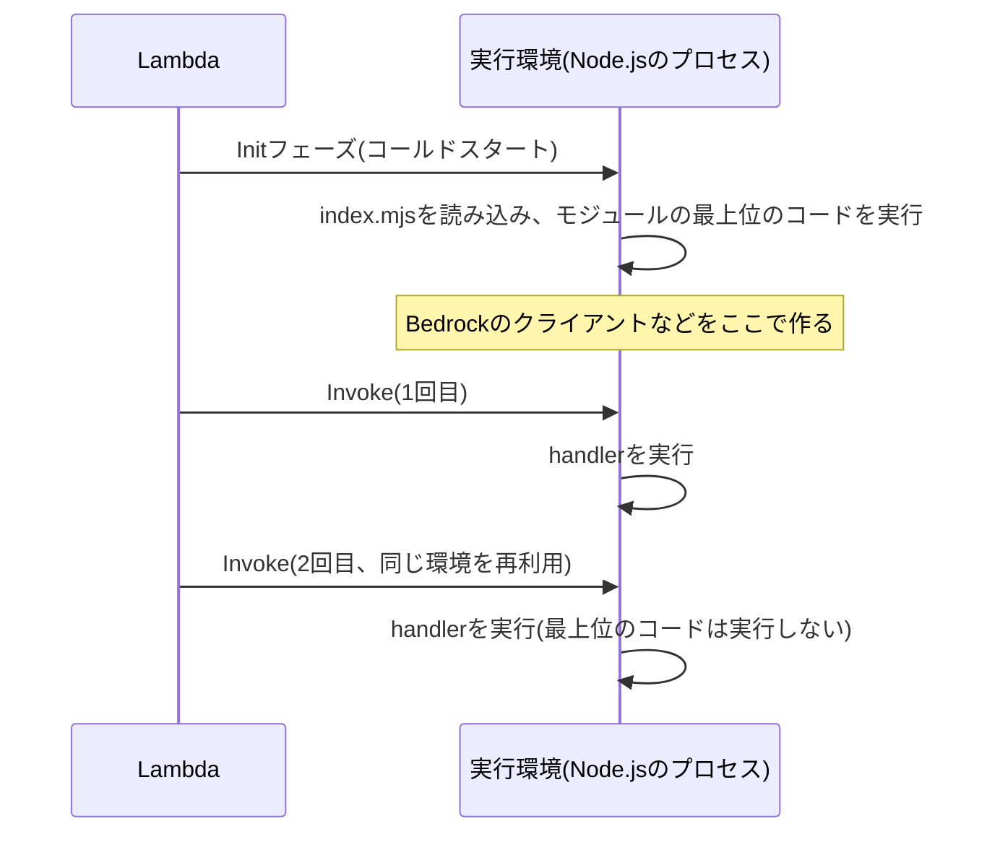

- Init: Lambdaは`index.mjs`を読み込み、モジュールの最上位にあるコードを実行します。このフェーズには10秒の上限があります。ここにかかった時間は、ログの`Init Duration`に出ます。
- Invoke: Lambdaは、exportされた`handler`関数を呼びます。同じ実行環境が続けて使われる(ウォームスタート)と、最上位のコードは再実行されず、そこで作ったオブジェクトがそのまま使われます。

ドキュメントは、「関数の実行前のレイテンシに最も大きく寄与するのは初期化のコード」と述べています。「パフォーマンスチューニング」の章で、この時間を実際に測ります。

### JavaScriptの実行と非同期処理

Node.jsは、GoogleのJavaScriptエンジンV8の上で動きます。V8は、JavaScriptを読み込むとまずバイトコードに変換してインタープリター(Ignition)で実行し、何度も実行される部分を最適化コンパイラー(TurboFan)で機械語にします([V8のブログ](https://v8.dev/blog/launching-ignition-and-turbofan))。読み込むコードが多いほど、この変換に時間がかかります。

もう1つ知っておくと役立つのが、非同期処理の仕組みです。Node.jsは1つのスレッドでJavaScriptを実行し、ネットワークの待ち時間などは[イベントループ](https://nodejs.org/learn/asynchronous-work/event-loop-timers-and-nexttick)で扱います。

- `Promise`は「あとで値が決まる入れ物」です。`await`は、その値が決まるまで関数の続きを後回しにします。
- `await`で待っているあいだも、Node.jsは他の処理を進めます。
- 値が永遠に決まらない`Promise`を`await`すると、その関数の続きは永遠に実行されません。

最後の性質は、durable functionsの「停止」の仕組みそのものです(「withDurableExecutionの中身」の節)。

## durable functionsの上でminamoが動く流れ

この章の内部の動きは、`@aws/durable-execution-sdk-js`のバージョン2.4.0のビルド済みコード(`dist/index.mjs`)を読んで確認したものです。SDKのソースは[GitHub](https://github.com/aws/aws-durable-execution-sdk-js)で公開されています。内部の実装なので、SDKのバージョンが変わると変わる可能性があります。

### `withDurableExecution`の中身

durable functionのハンドラーは、SDKの`withDurableExecution`で包みます。

```ts
export const handler = withDurableExecution(async (request: WorkerRequest, context: DurableContext) => {
  // ここに自分の処理を書く
});
```

Lambdaが実際に`handler`に渡すイベントは、利用者が送った入力そのものではありません。SDKのコードでは、イベントは`DurableExecutionArn`、`CheckpointToken`、`InitialExecutionState`(これまでの記録)を持つオブジェクトです。`withDurableExecution`は、次の処理をします。

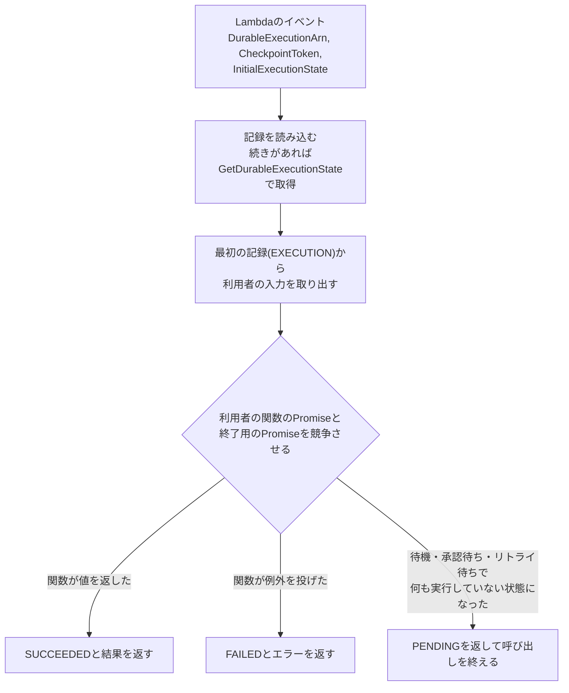

停止の仕組みは次のとおりです。

1. 利用者のコードが`waitForCallback`などで待つと、SDKはその`Promise`を解決しないまま放置します。
2. SDKは、実行中のオペレーションがなくなり、送るべきチェックポイントもなくなったことを検知すると、20ミリ秒後に終了用の`Promise`を解決します。
3. `Promise.race`で終了用の`Promise`が勝つので、SDKはLambdaに`PENDING`を返し、呼び出しを終えます。
4. 利用者の関数は、`await`の途中で止まったまま捨てられます。

次の呼び出しでは、コードを先頭から実行し直し、記録済みのところは記録を返しながら、止まった地点まで進みます。「待機中はコンピューティングの料金がかからない」のは、このように呼び出しそのものを終えているからです。

### オペレーションIDの決まり方

SDKは、コンテキストごとにカウンターを持ち、オペレーションを呼ぶたびに1ずつ増やします。ルートのコンテキストでは`1`、`2`、`3`、子コンテキストの中では`3-1`、`3-2`のように、親のIDを前に付けます。サービスに送るIDは、この文字列のMD5ハッシュの先頭16文字です。

実際に、チャットの例の実行履歴(`get-durable-execution-history`)を見ると、最初のstep(`publish-started`)のIDは`c4ca4238a0b92382`です。これは`md5("1")`の先頭16文字と一致します。

名前はIDの計算に使われません。SDKはリプレイのときに、同じIDの記録と今回の呼び出しで種類、名前、サブタイプが一致するかを検査し、一致しなければ実行を失敗させます。つまり、Lambdaでは「順序」でオペレーションを特定し、「名前」でずれを検出します。「オペレーションの同一性」の節の「名前と開始順の両方を守る」という原則は、この仕組みに対応しています。

### チェックポイントの送り方

SDKは、チェックポイントを1件ずつすぐに送るのではなく、キューに積んでまとめて送ります。

- キューに積まれたチェックポイントは、Node.jsの次の`setImmediate`のタイミングでまとめて送ります。
- 同時に送るリクエストは1つだけで、1回に最大250件、750KBまでまとめます。
- stepの開始(START)は送信の完了を待たず、stepの完了(SUCCEED)は送信の完了を待ちます。

並列のツールが同時にstepを完了すると、それらのチェックポイントは1回のAPI呼び出しにまとまります。

### 1ターンのオペレーションの木

チャットの例で「注文A-1001に3000円を返金して」と送ったときの実行履歴から、オペレーションの木を描くと次のようになります。

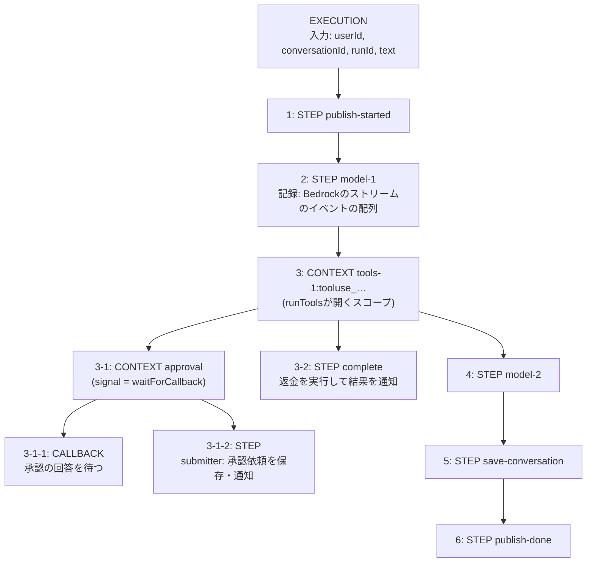

実際の履歴は次のとおりです(時刻はUTC、IDは先頭8文字)。

| 時刻 | イベント | 名前 | ID | 親 |
| --- | --- | --- | --- | --- |
| 10:37:39.499 | StepStarted | publish-started | c4ca4238 | |
| 10:37:39.783 | StepStarted | model-1 | c81e728d | |
| 10:37:41.025 | StepSucceeded | model-1 | c81e728d | |
| 10:37:41.073 | ContextStarted | tools-1:tooluse_UWGp… | eccbc87e | |
| 10:37:41.073 | ContextStarted | approval | c9e6e7b6 | eccbc87e |
| 10:37:41.073 | CallbackStarted | - | 284ee898 | c9e6e7b6 |
| 10:37:41.447 | StepSucceeded | -(submitter) | 91745dee | c9e6e7b6 |
| 10:37:41.484 | InvocationCompleted | | | |
| 10:37:47.206 | CallbackSucceeded | - | 284ee898 | c9e6e7b6 |
| 10:37:47.309 | StepStarted | complete | b772d43b | eccbc87e |
| 10:37:47.533 | StepStarted | model-2 | a87ff679 | |
| 10:37:49.630 | ExecutionSucceeded | | | |

10:37:41.484に1回目の呼び出しが終わり、承認が届いた10:37:47.206から2回目の呼び出しが始まっています。そのあいだの約6秒間、関数は動いていません。

### 承認待ちの流れ

画面、API、ワーカー、durable functionsのサービスのあいだのやり取りは次のとおりです。

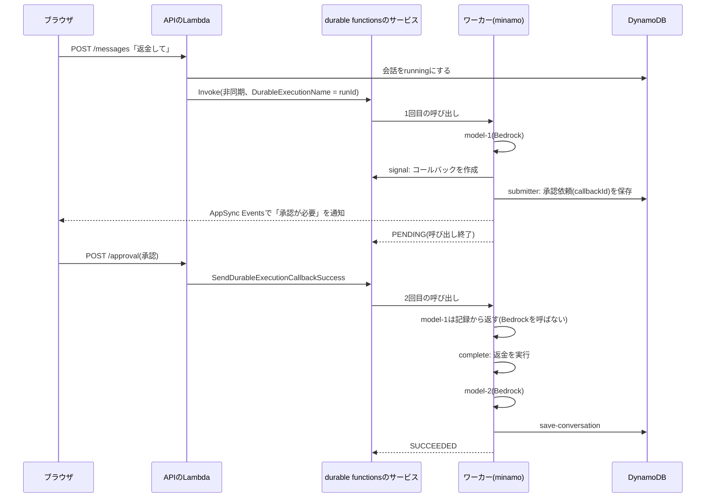

APIは、ワーカーを呼ぶときに`DurableExecutionName`へ実行ごとのID(`runId`)を渡します。[Idempotency](https://docs.aws.amazon.com/lambda/latest/dg/durable-execution-idempotency.html)のページによると、実行名はアカウントとリージョンの中で一意で、同じ名前と同じ入力で呼び直すと新しい実行を作りません。APIの呼び出しがリトライされても、エージェントが二重に動くことはありません。

## SDKとの連携: `@minamojs/lambda-df`を読む

Lambdaのアダプターは、全体で43行です。ここでは、その全文を部分ごとに読みます。原文は[packages/lambda-df/src/index.ts](https://github.com/har1101/minamo/blob/main/packages/lambda-df/src/index.ts)です。

### コーデックをSDKのserdesにする

```ts
import { createRetryStrategy, type DurableContext, type Serdes } from "@aws/durable-execution-sdk-js";
import { parse, stringify, type Duration, type Durable, type Retry, type StepInfo } from "@minamojs/minamo";

/** Binary-safe JSON for every checkpoint the core writes. */
function serdes<T>(): Serdes<T> {
  return {
    serialize: async value => value === undefined ? undefined : stringify(value),
    deserialize: async data => data === undefined ? undefined : parse<T>(data),
  };
}
```

SDKは、stepなどの結果を保存するときに`Serdes`(serializeとdeserializeの組)を使います。既定のserdesは`JSON.stringify`と`JSON.parse`です([Serialization](https://docs.aws.amazon.com/durable-execution/sdk-reference/state/serialization/))。アダプターは、これをminamoのコーデック(`Uint8Array`をbase64で保存する)に差し替えます。「コーデックはエンジンの境界に置く」の節の原則を実装している部分です。

SDKは、初回の実行でもstepの戻り値を一度シリアライズしてからデシリアライズして返します。そのため、初回とリプレイで戻り値の形が完全に同じになります。

### `step`と`scope`

```ts
export function lambda(context: DurableContext): Durable {
  const executionId = context.executionContext.durableExecutionArn;
  return {
    executionId,
    step<T>(name: string, fn: (info: StepInfo) => Promise<T>, options?: { retry?: Retry }) {
      return Promise.resolve(context.step(name, step => fn({ attempt: step.attempt }), {
        serdes: serdes<T>(), retryStrategy: options?.retry ? retryStrategy(options.retry) : () => ({ shouldRetry: false }),
      }));
    },
    scope<T>(name: string, fn: (child: Durable) => Promise<T>) {
      return Promise.resolve(context.runInChildContext(name, child => fn(lambda(child)), { serdes: serdes<T>() }));
    },
```

- `executionId`には、実行のARNを使います。ARNはリプレイでも再開でも変わりません。
- `step`は`context.step`に対応します。`retry`がなければ、SDKの既定のリトライを止めるために`() => ({ shouldRetry: false })`を渡します(「既定値をエンジンに任せない」の節)。
- `scope`は`context.runInChildContext`に対応します。子コンテキストを受け取ったら、それをもう一度`lambda()`で包んで`Durable`にします。この再帰で、スコープの中でもstepやsignalが使えます。

`Promise.resolve(...)`で包んでいるのは、SDKが返す`DurablePromise`が`Promise`を継承していない「thenable」(`then`メソッドを持つオブジェクト)だからです。`Durable`インターフェースは本物の`Promise`を返すと約束しているので、ここで変換します。

アダプターのコメントは「`DurablePromise`は遅延評価なので、`Promise.resolve`ですぐに開始させて呼び出し順を保つ」と説明しています。しかしバージョン2.4.0のSDKのコードを読むと、`context.step(...)`を呼んだ時点でIDの採番と処理の開始が行われ、`DurablePromise`が遅らせるのは結果の受け取りだけです。呼び出し順を保っているのは、実際には「オペレーションの同一性」の節で説明した「minamoがオペレーションを同期的に決まった順序で呼ぶ」ことです。`Promise.resolve`は無害ですが、コメントは実装と合っていません。

### `signal`

```ts
    async signal<T>(name: string, publish: (token: string) => Promise<void>, options?: { timeout?: Duration }) {
      const raw = await context.waitForCallback(name, token => publish(token), options?.timeout ? { timeout: seconds(options.timeout) } : undefined);
      return parse<T>(raw || "null");
    },
  };
}
```

`signal`は`context.waitForCallback`に対応します。[Callbackのページ](https://docs.aws.amazon.com/durable-execution/sdk-reference/operations/callback/)によると、`waitForCallback`は内部で子コンテキストを作り、その中でコールバックを作成してから、submitter関数をstepとして実行します。「1ターンのオペレーションの木」の節の図で`approval`の下に`CALLBACK`と`STEP`が並んでいたのは、このためです。

submitterはstepの中で動くので、完了すればリプレイで再実行されません。承認の依頼が二重に送られることはありません。

コールバックの結果は、`SendDurableExecutionCallbackSuccess`で送られた文字列がそのまま返ります。アダプターはそれをminamoの`parse`でJSONとして読みます。

注意点が1つあります。アダプターは`waitForCallback`に`retryStrategy`を渡していないので、submitterのstepにはSDKの既定のリトライ(合計6回)が効きます。「既定値をエンジンに任せない」の節の「`retry`がなければ1回だけ実行する」という原則とは異なる振る舞いです。

### `Retry`をSDKのリトライ戦略に変換する

```ts
function retryStrategy({ when, initialDelay, maxDelay, ...rest }: Retry) {
  const strategy = createRetryStrategy({
    ...rest, ...(initialDelay && { initialDelay: seconds(initialDelay) }), ...(maxDelay && { maxDelay: seconds(maxDelay) }),
  });
  return (error: Error, attempts: number) => (when?.(error) ?? true) ? strategy(error, attempts) : { shouldRetry: false };
}

function seconds({ days = 0, hours = 0, minutes = 0, seconds = 0 }: Duration) {
  return { seconds: ((days * 24 + hours) * 60 + minutes) * 60 + seconds };
}
```

SDKのリトライ戦略は、「エラーと試行回数を受け取り、リトライするかどうかと待ち時間を返す関数」です。アダプターは、SDKの`createRetryStrategy`で指数バックオフの計算を任せ、その前にminamoの`when`でリトライする価値のあるエラーかを判定します。`createRetryStrategy`は既定でFULLジッター(待ち時間を0から計算値までの乱数にする)を使うので、多くの実行が同時に失敗しても、再試行の時刻が分散します。

SDKのコードでは、リトライの待ち時間は秒単位に丸められ、最短1秒です。リトライを待つあいだ、他に実行中の処理がなければ、SDKは呼び出しを終えて`PENDING`を返します。待ち時間が過ぎると、サービスが新しい呼び出しを始めます。[Retries](https://docs.aws.amazon.com/durable-execution/sdk-reference/error-handling/retries/)のページも「リトライの待機中はLambdaの実行時間を消費しない」と説明しています。

### 対応表

| minamo | SDK | できるオペレーション |
| --- | --- | --- |
| `durable.executionId` | `context.executionContext.durableExecutionArn` | なし |
| `durable.step(name, fn, { retry })` | `context.step(name, fn, { serdes, retryStrategy })` | STEP 1つ |
| `durable.scope(name, fn)` | `context.runInChildContext(name, fn, { serdes })` | CONTEXT 1つと、その中身 |
| `durable.signal(name, publish, { timeout })` | `context.waitForCallback(name, submitter, { timeout })` | CONTEXT 1つ、CALLBACK 1つ、STEP 1つ |
| `model(durable, name, call)` | `durable.step`を1回 | STEP 1つ(ストリームのイベントの配列を記録) |
| `runTools(durable, turn, calls, tools)` | ツール呼び出しごとに`durable.scope` | ツールごとにCONTEXT 1つと、その中身 |

## 使い方: チャットアプリの例

### 構成

このリポジトリの[examples/chat](../../examples/chat)は、ログイン付きのチャットアプリです。ワーカーの実装を、Strands Agents版([worker.ts](../../examples/chat/backend/src/worker.ts))とminamo版([worker-minamo.ts](../../examples/chat/backend/src/worker-minamo.ts))から選べます。API、DynamoDBの保存形式、ライブイベント、画面は共通です。

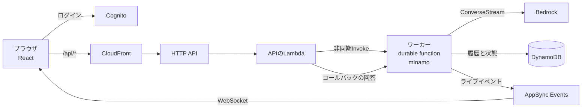

ツールは3つです。

| ツール | 種類 | 内容 |
| --- | --- | --- |
| `add_numbers` | 普通のツール | 2つの数を足します |
| `lookup_order` | 普通のツール | 注文を調べます。実際のAPIの遅さを再現するため500ミリ秒待ちます |
| `issue_refund` | workflowツール | 担当者の承認を待ってから返金します |

### 普通のツールを書く

普通のツールは、`run`関数を持つオブジェクトです。チャットの例では、ブラウザへのライブイベントの送信を足すために、小さな関数で包んでいます。

```ts
const plain = (name: string, run: (input: unknown) => unknown): Tool => ({
  run: async (input, { idempotencyKey }) => {
    const toolUseId = toolUseIdOf(idempotencyKey);
    await channel.publish({ kind: "tool", tool: name, toolUseId, status: "progress" });
    try {
      const output = await run(input);
      await channel.publish({ kind: "tool", tool: name, toolUseId, status: "success", result: output });
      return output;
    } catch (error) {
      const text = error instanceof Error ? error.message : String(error);
      await channel.publish({ kind: "tool", tool: name, toolUseId, status: "error", text });
      throw error;
    }
  },
});

add_numbers: plain("add_numbers", input => ({ sum: numberField(input, "a") + numberField(input, "b") })),
lookup_order: plain("lookup_order", input => lookupOrder(stringField(input, "orderId"))),
```

- `run`はstepの中で動きます。そのため、ライブイベントの送信もstepの中で行われ、リプレイでは送り直されません。
- `numberField`と`stringField`は、モデルが渡した入力を検査します。形が違えば例外を投げ、minamoはそれをエラーの結果としてモデルに返します。
- `toolUseIdOf`は、`idempotencyKey`(`<executionId>#<ツール呼び出しID>`)からツール呼び出しIDを取り出します。minamoの`ToolContext`はツール呼び出しIDを直接渡さないので、ドキュメントに書かれた形式から取り出しています。

### workflowツールで承認を待つ

```ts
issue_refund: {
  workflow: async (input, { durable, idempotencyKey }) => {
    const orderId = stringField(input, "orderId");
    const amount = numberField(input, "amount");
    const toolUseId = toolUseIdOf(idempotencyKey);
    const reason = { action: "issue_refund", orderId, amount };
    // callbackIdを画面に渡し、誰かが回答するまで停止する。停止中は関数が動かない
    const answer = await durable.signal<{ approved?: unknown } | null>("approval", async callbackId => {
      await requestApproval({ callbackId, interrupt: { id: toolUseId, name: "approval", reason } });
      await channel.publish({ kind: "tool", tool: "issue_refund", toolUseId, status: "interrupted", result: reason });
    }, { timeout: { minutes: 30 } });
    // 回答を受け取ったら、返金をstepの中で実行する
    return durable.step("complete", async () => {
      const output = answer?.approved === true ? issueRefund(orderId, amount, idempotencyKey) : { status: "rejected", orderId };
      await channel.publish({ kind: "tool", tool: "issue_refund", toolUseId, status: "success", result: output });
      return output;
    });
  },
},
```

`signal`の第2引数(submitter)は、コールバックのID(`callbackId`)を受け取ります。例では、このIDをDynamoDBに保存し、ブラウザに通知します。ブラウザで「承認」を押すと、APIが`SendDurableExecutionCallbackSuccess`に`{"approved":true}`を渡し、ワーカーが新しい呼び出しで再開します。

返金には`idempotencyKey`を渡しています。本物の決済APIなら、このキーで二重の返金を防げます(「exactly-onceを約束しない」の節)。

### ループを書く

エージェントのループは、普通の`for`文です。

```ts
async function agent(durable: Durable, messages: Message[], { channel, tools }: Loop) {
  for (let turn = 1; turn <= MAX_TURNS; turn++) {
    // 1回のモデル呼び出しが1つのstepになる。リプレイでは記録したイベントが返り、Bedrockは呼ばれない
    const events = await model(durable, `model-${turn}`, () => converse(messages, channel, turn));
    const { message, stopReason } = assemble(events);
    messages.push(message);
    const calls = (message.content ?? []).flatMap(block => block.toolUse
      ? [{ id: block.toolUse.toolUseId!, name: block.toolUse.name!, input: block.toolUse.input }]
      : []);
    if (calls.length === 0) return stopReason;
    // ツール呼び出しは並列に実行し、それぞれtools-<turn>:<toolUseId>のスコープに入る
    messages.push(toolResultMessage(await runTools(durable, `tools-${turn}`, calls, tools)));
  }
  throw new Error(`No final answer after ${MAX_TURNS} turns`);
}
```

- `converse`は、BedrockのConverseStream APIを呼び、ストリームのイベントを1つずつ返す関数です。minamoは、このイベントを全部まとめて1つのstepの結果として記録します。
- `assemble`は、記録したイベントからアシスタントのメッセージを組み立てます。この処理はstepの外にありますが、入力が記録済みのイベントだけなので、リプレイでも同じ結果になります(「決定性のルール」の節)。
- `messages`は、stepの外で毎回組み立て直されます。リプレイでも、記録済みのモデルの応答とツールの結果から同じ配列ができあがります。

### ハンドラー

```ts
export const handler = withDurableExecution(async (request: WorkerRequest, context: DurableContext) => {
  validate(request);
  const durable = lambda(context);   // SDKのcontextをminamoのDurableにする
  // 会話の履歴はstepの外で読み込む。この実行はbaseSeqより後ろにしか書かないので、毎回同じ履歴になる
  const history = (await loadMessages(conversationId, baseSeq)).map(/* ... */);
  await durable.step("publish-started", () => channel.publish({ kind: "run_started" }));
  const messages = [...history, { role: "user", content: [{ text }] }];
  const stopReason = await agent(durable, messages, { channel, tools: shopTools(/* ... */) });
  await durable.step("save-conversation", () => completeRun(/* ... */));
  await durable.step("publish-done", () => channel.publish({ kind: "done" }));
  return { runId, stopReason };
});
```

(説明のために一部を省略しています。全文は[worker-minamo.ts](../../examples/chat/backend/src/worker-minamo.ts)にあります。)

DynamoDBから履歴を読む処理は、あえてstepの外に置いています。stepの中に置くと、会話の履歴全体がチェックポイントに保存され、長い会話では256KBの上限に近づくからです。この実行が書き込むのは`baseSeq`より後ろのメッセージだけで、実行中は同じ会話で別の実行が始まらないので、何度読んでも同じ履歴になります。

### デプロイと動作確認

リポジトリのルートで次のコマンドを実行します。SAM CLIは不要です。

```bash
npm ci
WORKER_ENGINE=minamo AWS_REGION=us-east-1 examples/chat/scripts/deploy.sh
```

`WORKER_ENGINE=minamo`を付けると、ビルドスクリプトは`src/worker-minamo.ts`をワーカーとしてバンドルし、`minamo-durable-chat`というスタックを作ります。付けなければStrands版の`strands-durable-chat`になります。

スモークテストは、HTTP APIを通さずにワーカーを直接呼び、実行履歴を検査します。

```bash
export WORKER_ENGINE=minamo AWS_REGION=us-east-1
export WORKER_ALIAS_ARN=<スタック出力のWorkerAliasArn>
export CONVERSATIONS_TABLE=<ConversationsTable> MESSAGES_TABLE=<MessagesTable>
npm run smoke -w @strands-lambda-durable/example-chat-backend           # リプレイ
npm run smoke:approval -w @strands-lambda-durable/example-chat-backend  # 承認で再開
npm run smoke:parallel -w @strands-lambda-durable/example-chat-backend  # 並列のツール
```

2026-09-24の結果は次のとおりです。3つとも`failures: []`でした。

| シナリオ | 結果 | 呼び出し回数 | 確認したこと |
| --- | --- | --- | --- |
| replay | SUCCEEDED | 2 | `model-1`のあとに2秒の`wait`で停止し、2回目の呼び出しで`model-1`を記録から返しました。`model-1`のstepは1回だけ開始しました |
| approval | SUCCEEDED | 2 | 承認待ちで1回目の呼び出しが終わり、コールバックの回答で再開しました。`complete`のstepが1回だけ実行され、返金IDが保存されました |
| parallel | SUCCEEDED | 1 | 2つの`lookup_order`が、`tools-1:tooluse_…`という別々のスコープの中で実行されました |

ブラウザでも、Cognitoでログインして次のことを確認しました。

- 2件の注文の照会で、2つのツールのカードと回答の文章がライブで表示されました。
- 返金の依頼で承認のカードが表示され、ページを再読み込みしても承認待ちの状態が残りました。「承認」で返金IDが発行され、「却下」では`rejected`の結果をモデルが説明しました。
- 同じ会話で「さっきの返金IDだけをもう一度教えて」と送ると、保存した履歴を使って返金IDを答えました。

### Strands版との違い

| 観点 | Strands版 | minamo版 |
| --- | --- | --- |
| ループ | Strandsの`Agent`が持ちます | 利用者が`for`文で書きます |
| モデルの呼び出し | Strandsの`BedrockModel`を`DurableModel`で包みます | BedrockのConverseStreamを直接呼び、`model()`で記録します |
| ツールの定義 | Strandsの`tool()`とzodのスキーマ | JSON Schemaを直接書き、入力は各ツールで検査します |
| 人の承認 | Strandsのinterruptを、ライブラリがコールバックに変換します | workflowツールの中で`signal`を使います |
| 大きなチェックポイント | S3へ退避する`createOffloadSerdes`があります | 退避の仕組みはありません |
| ワーカーのバンドル(minifyなし) | 4,132KB | 2,305KB |

Strands版は、Strandsの機能(会話の管理、MCP、フック)をそのまま使えるのが利点です。minamo版は、依存が少なく、何がstepになるかをコードから直接読み取れるのが利点です。

### AWSを使わずにテストする

minamoの`MemoryEngine`は、本物のエンジンと同じようにリプレイします。呼び出しのたびにハンドラーを先頭から実行し、記録済みの結果を返します。`crash`オプションを使うと、オペレーションを記録した直後に呼び出しを止められます。

```ts
import { MemoryEngine } from "@minamojs/minamo/memory";

const engine = new MemoryEngine({ crash: () => true }); // 記録するたびにクラッシュさせる
const running = engine.run((durable, prompt: string) => agent(durable, prompt), "hello");
engine.complete(token, { approved: true }); // signalに回答する。tokenはpublishが受け取った値
const result = await running;
```

「記録するたびにクラッシュ」させても最終的に同じ結果になれば、どの地点で止まっても正しく再開できることを確かめられます。Lambdaの挙動をローカルで確かめたいときは、AWSの[`@aws/durable-execution-sdk-js-testing`](https://github.com/aws/aws-durable-execution-sdk-js)の`LocalDurableTestRunner`も使えます。minamoのテストは、同じエージェントを両方のエンジンで動かしています。

## パフォーマンスチューニング

### 時間とお金はどこにかかるか

durable functionsの上のエージェントでは、コストの発生源が普通のLambdaより増えます。

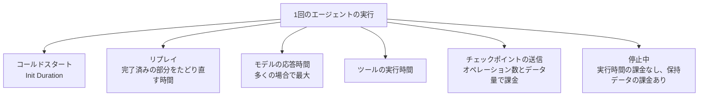

チャットの例の承認のシナリオでは、`model-1`のstepが1.24秒、`model-2`のstepが1.71秒かかりました。一方、`publish-started`のような軽いstepは0.03〜0.25秒でした。エージェントでは多くの場合モデルの応答時間が支配的なので、まずモデルの呼び出し回数と出力トークン数を減らすことが最も効きます。そのうえで、次の節の項目を見直します。

### コールドスタートを短くする

コールドスタートの時間は、Initフェーズで読み込んで実行するコードの量でほぼ決まります。チャットの例のワーカーで、バンドルの大きさを比べました。

| ワーカー | バンドル(minifyなし) | gzip後 | minify後 | minify後のgzip |
| --- | --- | --- | --- | --- |
| Strands版 | 4,132KB | 749KB | 1,910KB | 511KB |
| minamo版 | 2,305KB | 401KB | 996KB | 283KB |

中身の内訳(minifyなし)の上位は次のとおりです。

| Strands版 | minamo版 |
| --- | --- |
| zod 733KB | @smithy/core 426KB |
| @strands-agents/sdk 546KB | @aws-sdk/client-s3 302KB |
| @smithy/core 427KB | @aws-sdk/client-lambda 238KB |
| @aws-sdk/client-s3 302KB | @aws/durable-execution-sdk-js 204KB |
| @aws-sdk/client-lambda 238KB | @aws-sdk/client-dynamodb 187KB |
| ajv 207KB | @aws-sdk/core 176KB |
| @aws/durable-execution-sdk-js 205KB | @aws-sdk/nested-clients 130KB |
| @aws-sdk/client-dynamodb 187KB | @aws-sdk/client-bedrock-runtime 114KB |
| @modelcontextprotocol/sdk 177KB | |

minamo版の残りの大部分はAWS SDKです。minamoのコアとアダプターは合わせて約3KB(minify後)しかありません。

同じバンドルを使って、読み込みの時間も測りました。

| 計測 | Strands版 | minamo版 |
| --- | --- | --- |
| 手元のNode.js 24(arm64)で新しいプロセスから`import`する時間。7回の中央値、minifyなし | 187ミリ秒 | 111ミリ秒 |
| 同上、minifyあり | 181ミリ秒 | 111ミリ秒 |
| Lambda(nodejs22.x、arm64、1,024MB)のInit Duration。毎回新しい実行環境で10回、中央値(最小〜最大) | 591ミリ秒(381〜720) | 357ミリ秒(247〜439) |

Lambdaでの計測は、2つのバンドルをそれぞれ普通のLambda関数としてデプロイし、呼び出しの前に毎回環境変数を書き換えて新しい実行環境を作らせる方法で行いました。durable functionとして動いているワーカーでも、デプロイ直後などに記録された`initDurationMs`は、Strands版が478〜1,044ミリ秒(10回)、minamo版が464ミリ秒と767ミリ秒(2回)でした。回数が少なく、条件もそろっていないので、比較には上の表の値を使います。

この結果から、次のことが分かります。

- 読み込むコードを減らすと、コールドスタートは短くなります。Strands版とminamo版の差は、ほぼzod、Strands、MCP、ajvといった依存の分です。
- minifyは、ファイルの大きさを半分にしますが、読み込みの時間はほとんど変えません。時間の多くは、ファイルを読む処理ではなく、モジュールの最上位のコードを実行する処理にかかっているからです。

コールドスタートを短くする方法は次のとおりです。

1. 使わない依存を入れない: ワーカーで使わないパッケージ(たとえば別の関数だけが使うS3のクライアント)をimportしないようにします。バンドルの内訳は、esbuildの`metafile`オプションで出力できます。
2. まれにしか使わない依存は、使うときに読み込む: `await import("...")`で動的に読み込むと、Initフェーズの読み込みから外せます。LambdaのSDKも、Lambdaのクライアント(`@aws-sdk/client-lambda`)をこの方法で遅れて読み込みます。
3. クライアントはモジュールの最上位で作る: Bedrockのクライアントをハンドラーの外で作ると、ウォームスタートで再利用されます。チャットの例はこの形です。
4. ソースマップを必要なときだけ使う: [Node.jsのドキュメント](https://nodejs.org/api/cli.html)は、`--enable-source-maps`を有効にすると`Error.stack`を読むときに遅くなることがあると述べています。
5. プロビジョニングされた同時実行: [Provisioned concurrency](https://docs.aws.amazon.com/lambda/latest/dg/provisioned-concurrency.html)は、あらかじめ初期化した実行環境を用意しておく機能です。初期化の料金は、リクエストがなくてもかかります。
6. SnapStartはNode.jsでは使えない: [SnapStart](https://docs.aws.amazon.com/lambda/latest/dg/snapstart.html)の対応ランタイムはJava、Python、.NETで、ドキュメントは`nodejs24.x`を対応外として挙げています。

### リプレイの時間を短くする

durable functionsでは、停止から再開するたびに、コードを先頭から実行し直します。完了済みのオペレーションは記録を返すだけなので速いものの、次の2つには時間がかかります。

- stepの外にあるコード: リプレイのたびに実行されます。チャットの例では、DynamoDBからの履歴の読み込みが毎回実行されます。
- 記録の読み込みとデシリアライズ: 記録が多いほど時間がかかります。SDKは、`GetDurableExecutionState`で1回に最大1,000件ずつ記録を読み込みます。

対策は次のとおりです。

1. 完了したスコープの中身はリプレイされないことを利用する: SDKは、完了した子コンテキストの関数を実行せず、記録した結果だけを返します。minamoの`runTools()`はツールごとにスコープを作るので、完了したツールの中身はリプレイでたどり直されません。
2. 1つの実行を長くしすぎない: チャットの例は、会話全体ではなく「1回のユーザーの発言」を1つの実行にしています。会話が長くなっても、1つの実行の記録は増えません。minamoのREADMEも「長い会話は複数の実行に分ける」ことを勧めています。
3. 入力を小さくする: [State management](https://docs.aws.amazon.com/durable-execution/patterns/best-practices/state/)のページによると、ハンドラーの入力は保存され、リプレイのたびに読み込まれます。大きなデータは入力に入れず、IDだけを渡してstepの中で読み込みます。

### オペレーション数とチェックポイントのデータ量を減らす

オペレーション数とデータ量は、料金と上限(3,000オペレーション、100MB、1回256KB)の両方に関わります。

実際の記録の大きさを、並列のシナリオの実行履歴で確かめました。

| オペレーション | 記録の大きさ | 内容 |
| --- | --- | --- |
| `model-1` | 1,911バイト | Bedrockのストリームのイベント24個 |
| `model-2` | 2,350バイト | 同31個(約270文字の回答) |
| ツールの`run`のstep | 265バイト、327バイト | ツールの結果 |
| ツールのスコープ | 265バイト、327バイト | ツールの結果(stepと同じもの) |

見直せる点は次のとおりです。

1. モデルのストリームの記録を詰める: `model()`は、ストリームのイベントをすべて記録します。長い回答では、テキストの差分のイベントが数百個になります。`call`で返すストリームの中で、同じブロックのテキストの差分を1つのイベントにまとめてから返すと、記録を小さくできます。SDKはstepの記録が256KBを超えるかを事前に検査しないので、出力トークンの上限(`maxTokens`)と合わせて見積もっておきます。
2. 1つのツールで1つのstepにする: minamoの普通のツールは、1回の呼び出しでスコープ1つとstep1つ(2オペレーション)を使います。ツールの中で細かくstepを分けると、オペレーションが増えます。
3. スコープとstepの二重の記録を意識する: 上の表のとおり、普通のツールの結果はstepとスコープの両方に記録されます。巨大な結果を返すツールは、結果をS3などに置き、そのキーだけを返すようにします。
4. `waitForCallback`は3オペレーションを使う: 承認を細かく何度も求める設計にすると、オペレーションが増えます。

### 待ち時間を減らす

1. ライブイベントの送信でストリームを止めない: チャットの例では、モデルのテキストをAppSync Eventsに送るとき、送信の完了を`await`で待たずに`Promise`をつないでいきます。順序を保ったまま、Bedrockのストリームの読み取りが送信を待たずに進みます。ストリームの最後で、送信がすべて終わるのを待ちます。

   ```ts
   let published = channel.publish({ kind: "model_start", call, attempt });
   const flush = () => {
     // ...
     published = published.then(() => channel.publish({ kind: "text", call, attempt, text }));
   };
   for await (const event of response.stream) {
     // テキストをpendingに貯め、100ミリ秒ごとにflushする
     yield event;
   }
   flush();
   await published;
   ```

2. ライブイベントをまとめる: テキストの差分を1つずつ送らず、100ミリ秒ごとにまとめて送ります。[AppSync Eventsのクォータ](https://docs.aws.amazon.com/general/latest/gr/appsync.html)は、1回の発行で5イベント、1イベント240KBまでです。
3. 独立したツールは並列にする: `runTools()`はツールを並列に実行します。システムプロンプトで「独立した照会は1回の応答でまとめて呼ぶ」ように指示すると、モデルの呼び出し回数も減ります。並列のシナリオでは、500ミリ秒かかる`lookup_order`を2つ同時に実行しました。
4. リトライは二重にしない: チャットの例は、BedrockのクライアントのSDK内リトライを止め(`maxAttempts: 1`)、`model()`のstepのリトライに任せています。両方でリトライすると、失敗したときの試行回数が掛け算で増えます。
5. リトライの待ち時間の性質を知っておく: stepのリトライは、他に実行中の処理がなければ呼び出しを終え、待ち時間のあとに新しい呼び出しで再開します。待機中の実行時間は課金されませんが、再開のたびにリプレイとコールドスタートの可能性が加わります。待ち時間は最短1秒です。

### メモリとアーキテクチャ

- [メモリの設定](https://docs.aws.amazon.com/lambda/latest/dg/configuration-memory.html): LambdaはメモリサイズにCPUを比例して割り当てます。1,769MBで1vCPU相当です。チャットの例は1,024MBにしていて、実際に使ったメモリは最大145MB(minamo版)、158MB(Strands版)でした。メモリはまだ余っていますが、メモリを減らすとCPUも減り、Initやリプレイが遅くなる可能性があります。[AWS Lambda Power Tuning](https://github.com/alexcasalboni/aws-lambda-power-tuning)のような道具で、料金と時間のバランスを実測して決めます。
- [アーキテクチャ](https://docs.aws.amazon.com/lambda/latest/dg/foundation-arch.html): arm64(Graviton2)は、x86_64より価格性能比が高いとされています。チャットの例はarm64を使っています。

### 計測の方法

チューニングの前後で、次の方法で数値を取ります。

- ログの`platform.report`: durable functionsのログはJSON形式で、呼び出しごとに`initDurationMs`(コールドスタートのときだけ)、`durationMs`、`maxMemoryUsedMB`が出ます。
- 実行履歴: `aws lambda get-durable-execution-history --durable-execution-arn <ARN>`で、オペレーションごとの開始と完了の時刻、`InvocationCompleted`(呼び出しの終了)が分かります。`--include-execution-data`を付けると、記録した値も見られます。
- バンドルの内訳: esbuildの`metafile: true`で、どのパッケージがどれだけのバイトを占めるかが分かります。

## 制約と今後

### minamoの制約

- 少なくとも1回の実行です。副作用のあるツールは、`idempotencyKey`で重複を防ぐ必要があります。
- stepの外のコードは、リプレイのたびに実行されます。同じdurableな呼び出しを、同じ順序で行う必要があります。
- 大きな値をS3に退避する仕組みはまだありません。
- 時間だけ待つ`sleep`はありません。チャットの例のテスト用の待機は、SDKの`context.wait`を直接使っています。

### この記事を書くときに見つけたこと

SDKのコードを読み、チャットの例を作る中で、minamoについて次のことが分かりました。

- `@minamojs/lambda-df`のコメントは`DurablePromise`を遅延評価と説明していますが、バージョン2.4.0のSDKでは呼んだ時点で処理が始まります(「stepとscope」の節)。動作には影響しません。
- `signal`のsubmitterにはSDKの既定のリトライ(合計6回)が効きます(「signal」の節)。
- `model()`は、stepの記録が256KBを超えるかを検査しません(「オペレーション数とチェックポイントのデータ量を減らす」の節)。
- `ToolContext`はツール呼び出しIDを直接渡さないので、チャットの例は`idempotencyKey`から取り出しています(「普通のツールを書く」の節)。

### 今後

minamoの[ロードマップ](https://github.com/har1101/minamo/blob/main/docs/design.ja.md)は、npmのTrusted Publishingでの公開、必要に応じたS3へのオフロード、Cloudflare Workflowsのアダプターを挙げています。

## 参考資料

minamoとサンプル

- [har1101/minamo](https://github.com/har1101/minamo)(README、設計のドキュメント)
- [examples/chat](../../examples/chat)(この記事のチャットアプリ)

AWS Lambda durable functions

- [Lambda durable functions](https://docs.aws.amazon.com/lambda/latest/dg/durable-functions.html)
- [Durable execution SDK](https://docs.aws.amazon.com/lambda/latest/dg/durable-execution-sdk.html)
- [Invoking durable functions](https://docs.aws.amazon.com/lambda/latest/dg/durable-invoking.html)
- [Configure durable functions](https://docs.aws.amazon.com/lambda/latest/dg/durable-configuration.html)
- [Idempotency](https://docs.aws.amazon.com/lambda/latest/dg/durable-execution-idempotency.html)
- [Key concepts](https://docs.aws.amazon.com/durable-execution/getting-started/key-concepts/)
- [Determinism](https://docs.aws.amazon.com/durable-execution/patterns/best-practices/determinism/)
- [State management](https://docs.aws.amazon.com/durable-execution/patterns/best-practices/state/)
- [Step](https://docs.aws.amazon.com/durable-execution/sdk-reference/operations/step/)、[Child context](https://docs.aws.amazon.com/durable-execution/sdk-reference/operations/child-context/)、[Callback](https://docs.aws.amazon.com/durable-execution/sdk-reference/operations/callback/)
- [Retries](https://docs.aws.amazon.com/durable-execution/sdk-reference/error-handling/retries/)
- [Serialization](https://docs.aws.amazon.com/durable-execution/sdk-reference/state/serialization/)
- [OperationUpdate API](https://docs.aws.amazon.com/lambda/latest/api/API_OperationUpdate.html)
- [aws/aws-durable-execution-sdk-js](https://github.com/aws/aws-durable-execution-sdk-js)
- [Lambdaのクォータ](https://docs.aws.amazon.com/lambda/latest/dg/gettingstarted-limits.html)、[Lambdaのサービスクォータ](https://docs.aws.amazon.com/general/latest/gr/lambda-service.html)
- [Lambdaの料金](https://aws.amazon.com/lambda/pricing/)

Lambda、TypeScript、Node.js

- [Lambdaの実行環境のライフサイクル](https://docs.aws.amazon.com/lambda/latest/dg/lambda-runtime-environment.html)
- [TypeScriptでLambda関数を書く](https://docs.aws.amazon.com/lambda/latest/dg/lambda-typescript.html)
- [Node.jsのハンドラー](https://docs.aws.amazon.com/lambda/latest/dg/nodejs-handler.html)
- [メモリの設定](https://docs.aws.amazon.com/lambda/latest/dg/configuration-memory.html)、[アーキテクチャ](https://docs.aws.amazon.com/lambda/latest/dg/foundation-arch.html)
- [Provisioned concurrency](https://docs.aws.amazon.com/lambda/latest/dg/provisioned-concurrency.html)、[SnapStart](https://docs.aws.amazon.com/lambda/latest/dg/snapstart.html)
- [TypeScriptハンドブック: The Basics](https://www.typescriptlang.org/docs/handbook/2/basic-types.html)
- [Node.jsのTypeScriptの扱い](https://nodejs.org/api/typescript.html)、[Node.jsのイベントループ](https://nodejs.org/learn/asynchronous-work/event-loop-timers-and-nexttick)
- [esbuildのAPI](https://esbuild.github.io/api/)
- [V8: Launching Ignition and TurboFan](https://v8.dev/blog/launching-ignition-and-turbofan)

その他

- [Hono](https://hono.dev/docs/)、[Web Standard](https://hono.dev/docs/concepts/web-standard)、[Testing](https://hono.dev/docs/guides/testing)
- [Cloudflare Workflows: Rules of Workflows](https://developers.cloudflare.com/workflows/build/rules-of-workflows/)
- [Amazon Bedrock ConverseStream](https://docs.aws.amazon.com/bedrock/latest/APIReference/API_runtime_ConverseStream.html)
- [AppSync Events: HTTPでの発行](https://docs.aws.amazon.com/appsync/latest/eventapi/publish-http.html)、[AppSyncのクォータ](https://docs.aws.amazon.com/general/latest/gr/appsync.html)
